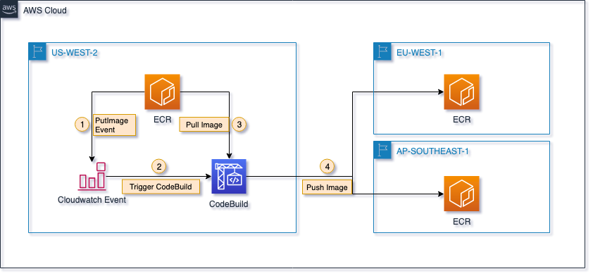

!!UPDATE: Please note that Amazon ECR has support [cross-region and cross-account replication](https://aws.amazon.com/about-aws/whats-new/2020/12/amazon-ecr-announces-cross-region-replication-of-images/), the maintainance for this project has been stopped.

# Amazon ECR repositories cross-region replication
Amazon ECR is a regional service and docker images in one region will not be replicated in other regions automatically. In the scenario of multi-region deployment, you may need to replicate docker images to the region where application deployed due to these reasons:
1. Cost, reduce cost of data transfer for images
2. Security, set [PrivateLink for ECR](https://aws.amazon.com/about-aws/whats-new/2019/01/aws-fargate--amazon-ecs--and-amazon-ecr-now-have-support-for-aws/) in each region to keep network traffic with ECR in VPC.
3. Availability, docker images should be replicated in each region to tolerate regional failure.

This project illustrates the solution to replicate images to several target regions whenever new docker images are pushed to the ECR registry in the source region.

## How it works

1. When docker clients push images to ECR repository, the PutImage event will be issued then we can setup CloudWatch event rule to receive this event and invoke targets like Lambda, CodeBuild, ECS tasks, etc.
2. In this solution, we set up a CodeBuild project as the target to be invoked by the CloudWatch event rule, event context such as repository name and image tag will be extracted from event and set as environment variables to CodeBuild project.
3. In the CodeBuild project, it will login to the source ECR registry and then pull images to the local docker environment.
4. It will then login to target ECR registries, and create the repository in target registries if it does not exist in target registries, then tag and push the image to target repositories in each target region.

## How to deploy
Choose the region where you would like it to be the ECR source region in AWS console, then launch template.yaml of this repository in AWS CloudFormation, specify target region code you want to replicate the docker images to, multiple target regions could be specified by comma separated region code, for example: "eu-west-1,ap-southeast-1"

Please note that only those new pushed images after this solution has been deployed in the source ECR registry will be replicated to target regions.

## License Summary

This sample code is made available under the MIT-0 license. See the LICENSE file.
